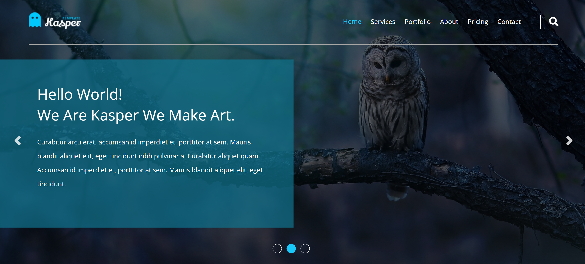

# Kasper - Elzero Web School Second HTML and CSS Template

This is a solution to the [ELzero Template](https://www.youtube.com/playlist?list=PLDoPjvoNmBAy1l-2A21ng3gxEyocruT0t). These template challenges help you improve your coding skills by building realistic projects.

## Table of contents

- [Overview](#overview)
  - [Screenshot](#screenshot)
  - [Links](#links)
- [My process](#my-process)
  - [Built with](#built-with)
- [Author](#author)

## Overview

### Screenshot

### Links

- [Elzero Final Design](https://elzerowebschool.github.io/HTML_And_CSS_Template_Two/)

## My process

### Built with

- Semantic HTML5 markup
- CSS custom properties
- Google Fonts
- Normalize CSS
- Font Awesome

## Author

- Frontend Mentor - [@AyaZayed](https://www.frontendmentor.io/profile/AyaZayed)
- Linkedin - [Aya Zayed](https://www.linkedin.com/in/aya-zayed-2000/)
